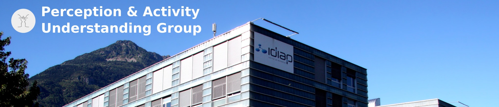

# Particle Person Tracker

The particle person tracker performs a head pose estimation and
tracking. The default face detector is based on OpenCV.

The detection can be improved by using a face detector based on
[OpenPose](https://github.com/CMU-Perceptual-Computing-Lab/openpose),
or additionally by using
[OpenHeadPose](https://gitlab.idiap.ch/software/openheadpose).

## Standard dependencies

```bash
sudo apt install gsl-bin
# sudo apt install libgsl2 # Obsolete package
sudo apt install libgsl-dev
sudo apt install libfftw3-dev
```

## Installing OpenPose (optional)

OpenCV 3 should be installed. If ROS kinetic/melodic is installed,
then OpenCV 3 is there, and you just need to add `source
/opt/ros/kinetic/setup.bash` in your `.bashrc`.

As an example of installation, we install the dependencies in `DEPS`:

```bash
DEPS="${HOME}/deps"
mkdir ${DEPS}
```

OpenPose will provide a better face detector. We install it in
`${DEPS}/openpose/build/install`.

First, CUDA and cuDNN should be installed. CUDA can be installed
following [these
instructions](https://docs.nvidia.com/cuda/cuda-installation-guide-linux/index.html)
and cuDNN can be installed with [these
instructions](https://docs.nvidia.com/deeplearning/sdk/cudnn-install/index.html).

Some dependencies are needed to install OpenPose/caffe.

```bash
sudo apt --assume-yes update
sudo apt --assume-yes install build-essential
sudo apt --assume-yes install cmake-curses-gui
sudo apt --assume-yes install libprotobuf-dev
sudo apt --assume-yes install libleveldb-dev
sudo apt --assume-yes install libsnappy-dev
sudo apt --assume-yes install libhdf5-serial-dev
sudo apt --assume-yes install protobuf-compiler
sudo apt --assume-yes install --no-install-recommends libboost-all-dev
sudo apt --assume-yes install libgflags-dev
sudo apt --assume-yes install libgoogle-glog-dev
sudo apt --assume-yes install liblmdb-dev
sudo apt --assume-yes install libopencv-dev
sudo apt --assume-yes install libatlas-base-dev
sudo apt --assume-yes install libatlas-dev
sudo apt --assume-yes install python-numpy
```

Then

```bash
DEPS="${HOME}/deps"
cd ${DEPS}
git clone https://github.com/CMU-Perceptual-Computing-Lab/openpose
cd openpose
mkdir build
cd build
cmake -DCMAKE_INSTALL_PREFIX=${PWD}/install -DDOWNLOAD_BODY_25_MODEL=ON -DDOWNLOAD_BODY_COCO_MODEL=ON -DDOWNLOAD_FACE_MODEL=OFF -DDOWNLOAD_HAND_MODEL=OFF ..
make
make install
```

Put the following line in your `.bashrc` to prevent GLOG verbosity:

```bash
export GLOG_minloglevel=2
```


## Installing OpenHeadPose (optional, but OpenPose required)

OpenHeadPose will provide both a better face detector (same as
OpenPose) and a better head pose estimation (yaw, pitch, and roll).
We install it in `${DEPS}/openheadpose/build/install`. Make sure that
OpenPose is installed (previous section).

```bash
DEPS="${HOME}/deps"
cd ${DEPS}
git clone https://gitlab.idiap.ch/software/openheadpose
cd openheadpose
mkdir build
cd build
cmake -DCMAKE_INSTALL_PREFIX=${PWD}/install -DOpenPose_PATH=${DEPS}/openpose/build/install ..
make
make install
```

## Compilation with ROS

The `particle_person_tracker` can be built with ROS kinetic/melodic.

```bash
source /opt/ros/kinetic/setup.bash
WS="${HOME}/perception_ws"
mkdir ${WS}/src
catkin_init_workspace ${WS}/src

cd ${WS}/src
git clone https://github.com/idiap/particle_person_tracker.git
git clone https://github.com/idiap/perception_msgs.git

cd ${WS}
# Without OpenPose/OpenHeadPose
# catkin_make
# With OpenPose/OpenHeadPose
catkin_make -DOpenPose_PATH=${DEPS}/openpose/build/install -DOpenHeadPose_PATH=${DEPS}/openheadpose/build/install
```

Example to run the particle tracker via ROS with the webcam:

```bash
# In terminal 1
roscore

# In terminal 2
roslaunch video_stream_opencv camera.launch camera_name:=camera

# In terminal 3
roslaunch particle_person_tracker main.launch color:=/camera/image_raw config:=config_openpose.ini delay:=50 particles:=100 scale:=0.5 detector:=openheadpose visu:=1
```

## Quick start test

```bash
./build/bin/openpose_facetrack -c build/bin/config_cv.ini -v 1 -i data/images.txt
```

## Citation

The work is described in

```
@TECHREPORT{Khalidov_Idiap-RR-02-2017,
  author = {Khalidov, Vasil and Odobez, Jean-Marc},
  projects = {Idiap, HUMAVIPS},
  month = {2},
  title = {Real-time Multiple Head Tracking Using Texture and Colour Cues},
  type = {Idiap-RR},
  number = {Idiap-RR-02-2017},
  year = {2017},
  institution = {Idiap},
  pdf = {http://publications.idiap.ch/downloads/reports/2013/Khalidov_Idiap-RR-02-2017.pdf}
}
```
